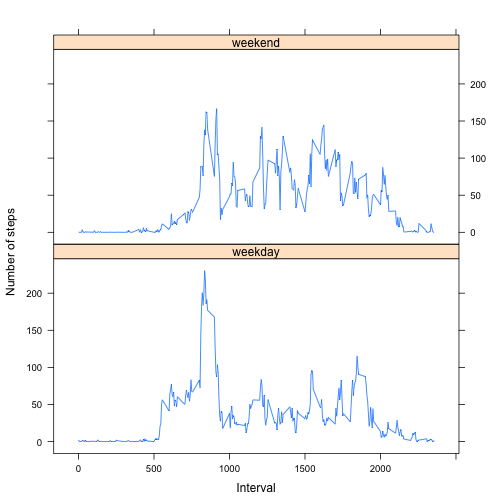

## Loading and preprocessing the data

```r
library(data.table)
```

```
## data.table 1.9.4  For help type: ?data.table
## *** NB: by=.EACHI is now explicit. See README to restore previous behaviour.
```

```r
actData <- read.csv("/Users/jenny/Documents/Work no Dropbox/Git/RepData_PeerAssessment1/activity.csv")

#transform the date variable into date variable
actData[,2] <- as.Date(actData$date)
dt <- data.table(actData)
```


## What is mean total number of steps taken per day?

```r
sumDailySteps <- dt[ , sum(steps, na.rm = TRUE), by = date]

hist( sumDailySteps$V1, 
      main = "Total number of steps per day",
      xlab = "Daily total")
```

 

```r
#Mean
summary(sumDailySteps)[4,2]
```

```
## [1] "Mean   : 9354  "
```

```r
#Median
summary(sumDailySteps)[3,2]
```

```
## [1] "Median :10395  "
```

```r
knitr::knit_hooks$set(inline = function(x) {
  knitr:::format_sci(x, 'md')
})
```

The mean and median total number of steps taken per day are 9354
and 1.0395&times; 10^4^, respectively.

## What is the average daily activity pattern?

```r
aveDailySteps <- dt[ , mean(steps, na.rm = TRUE), by = interval]
 plot(aveDailySteps$interval, aveDailySteps$V1, type = "l", xlab = "Interval", ylab = "Average daily steps")
```

 

```r
aveDailySteps[which.max(aveDailySteps$V1)]
```

```
##    interval       V1
## 1:      835 206.1698
```

The 5-minute interval 835, on average across all the days in the dataset, contains the maximum number of steps.

## Imputing missing values


```r
dt[,sum(is.na(steps)),]
```

```
## [1] 2304
```
The total number of missing values is 2304.


```r
actDataImp <- actData
for (s in 1:dim(actData)[1]) {
        if ( is.na(actData$steps[s]) ) {
                actDataImp$steps[s] <- aveDailySteps$V1[aveDailySteps$interval == actData[s,3]]
        }
}

dtImp <- data.table(actDataImp)

sumDailyStepsImp <- dtImp[ , sum(steps, na.rm = TRUE), by = date]

hist( sumDailyStepsImp$V1, 
      main = "Total number of steps per day, imputed data",
      xlab = "Daily total")
```

 

```r
#Mean
summary(sumDailyStepsImp)[4,2]
```

```
## [1] "Mean   :10766  "
```

```r
#Median
summary(sumDailyStepsImp)[3,2]
```

```
## [1] "Median :10766  "
```

```r
#What is the impact of imputing missing data on the estimates of the total daily number of steps?
sumDailySteps$V1 == sumDailyStepsImp$V1
```

```
##  [1] FALSE  TRUE  TRUE  TRUE  TRUE  TRUE  TRUE FALSE  TRUE  TRUE  TRUE
## [12]  TRUE  TRUE  TRUE  TRUE  TRUE  TRUE  TRUE  TRUE  TRUE  TRUE  TRUE
## [23]  TRUE  TRUE  TRUE  TRUE  TRUE  TRUE  TRUE  TRUE  TRUE FALSE  TRUE
## [34]  TRUE FALSE  TRUE  TRUE  TRUE  TRUE FALSE FALSE  TRUE  TRUE  TRUE
## [45] FALSE  TRUE  TRUE  TRUE  TRUE  TRUE  TRUE  TRUE  TRUE  TRUE  TRUE
## [56]  TRUE  TRUE  TRUE  TRUE  TRUE FALSE
```

```r
sum(sumDailySteps$V1) < sum(sumDailyStepsImp$V1)
```

```
## [1] TRUE
```

The mean and median total number of steps taken per day are 1.0766&times; 10^4^
and 1.0766&times; 10^4^, respectively.
The data look more normally distributed now and the mean and the median are equal.
The values do differ from the first part of the assignment. The total daily number of steps
are larger for those days thad had missings.

## Are there differences in activity patterns between weekdays and weekends?

```r
library(lattice)
dayIndex <- array(NA,length(actDataImp$date))
wkd <- weekdays(actDataImp$date)
WD <- c("Montag", "Dienstag", "Mittwoch", "Donnerstag", "Freitag")
WE <- c("Samstag", "Sonntag")

for (d in 1:length(dayIndex)) {
dayIndex[d] <- ifelse(wkd[d] %in% WD, "weekday", "weekend")
}

dayIndex <- as.factor(dayIndex)

actDataImp <- cbind(actDataImp,dayIndex)
dtImpInd <- data.table(actDataImp)

aveDailySteps <- dtImpInd[ , mean(steps, na.rm = TRUE), by = c("dayIndex","interval")]

xyplot(V1 ~ interval | dayIndex, data = aveDailySteps,
       type = "l", xlab = "Interval", ylab = "Number of steps", layout = c(1,2))
```

 

On weekends, the activity is slightly more equally distributed and does not peak as much around 800.
